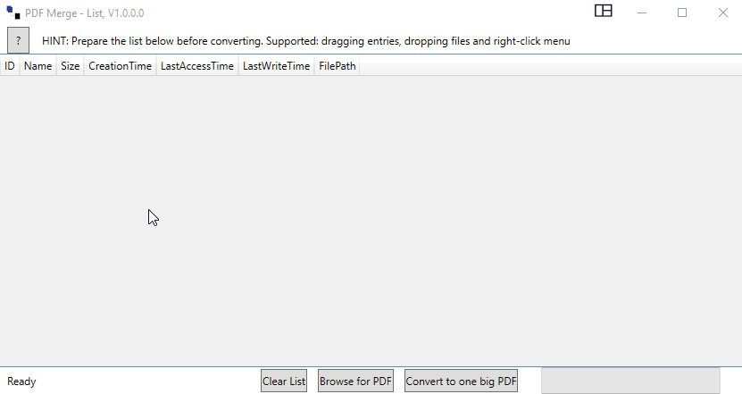

# MergePDFList
WPF App to merge a list of PDF Files to a single PDF

## License

Code released under the [MIT License][License].

## 3rd party Libraries and Code
PdfSharp [MIT License][PdfSharp]

Fody, Costura.Fody [MIT License][Costura]

WpfAboutView [MIT License][WpfAboutView]

Movable rows in WPF DataGrid [EIDIAS Blog][EIDAS.Blog]
,thanks to [EIDIAS][EIDAS]

DataGrid row-number [STACKOVERFLOW][DATAGRID.ROWNUM]

[License]: LICENSE.md
[PdfSharp]: http://www.pdfsharp.net/
[Costura]: https://github.com/Fody/Costura
[WpfAboutView]: https://github.com/danielchalmers/WpfAboutView
[EIDIAS]: https://www.eidias.com
[EIDIAS.Blog]: https://www.eidias.com/blog/2014/8/15/movable-rows-in-wpf-datagrid
[STACKOVERFLOW]: https://stackoverflow.com
[DATAGRID.ROWNUM]: https://stackoverflow.com/questions/4663771/wpf-4-datagrid-getting-the-row-number-into-the-rowheader/4663799#4663799

